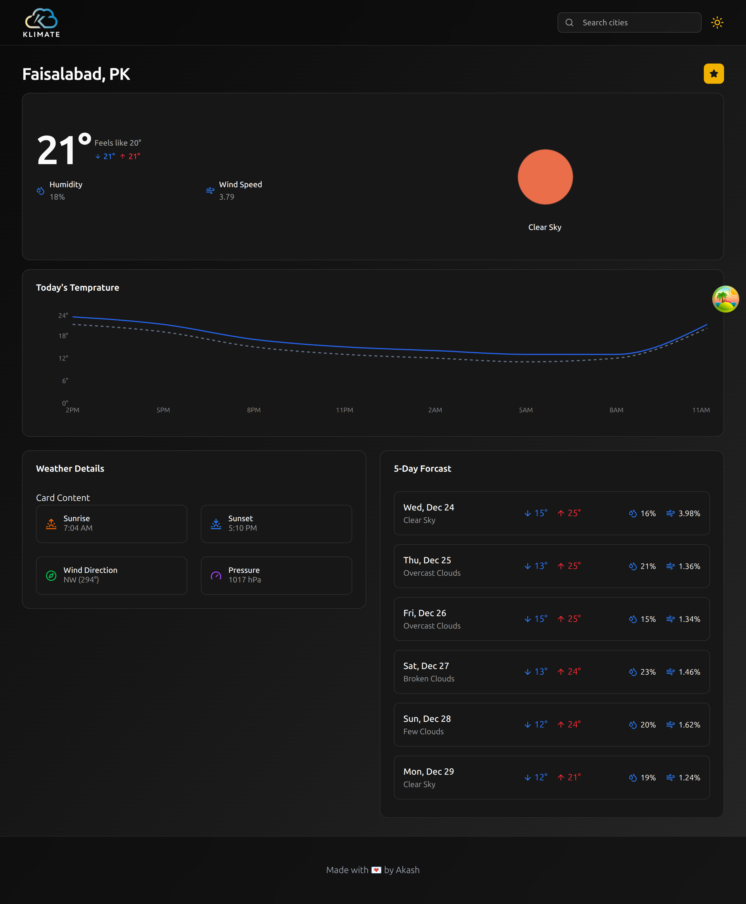
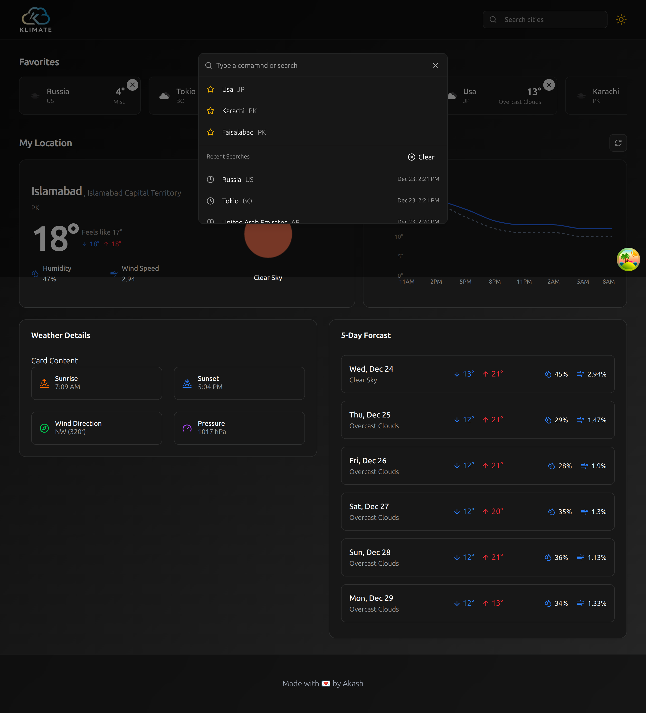
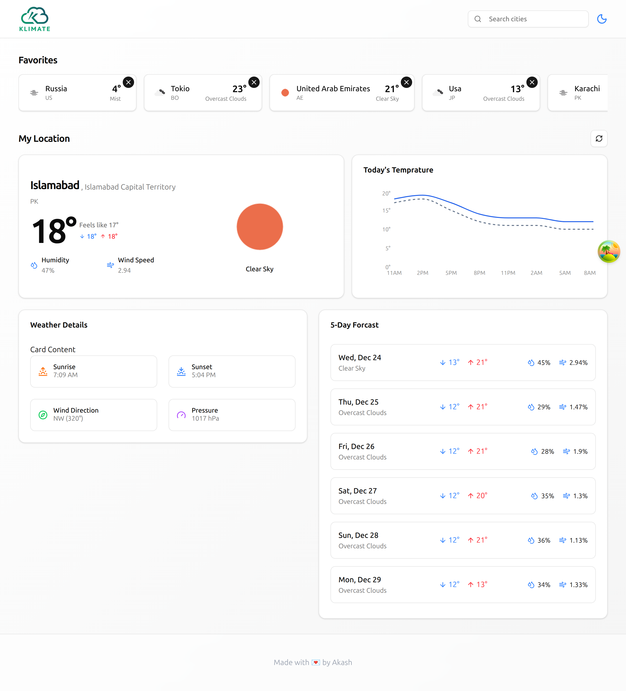
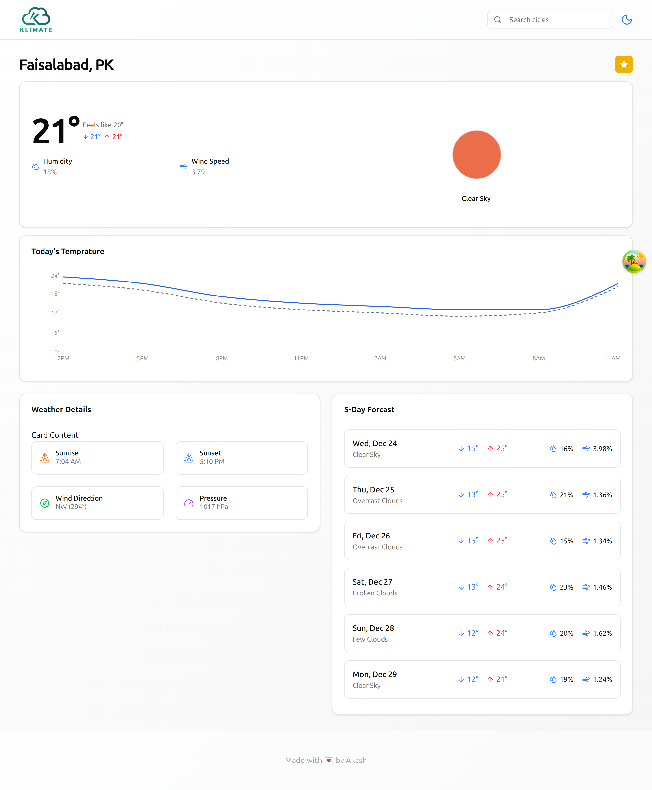
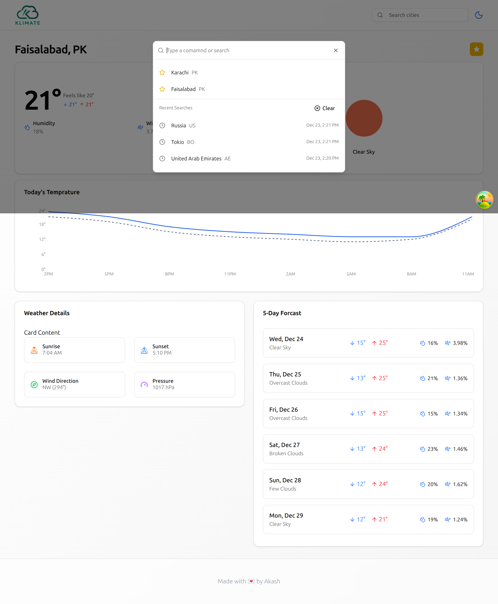

# 🌦️ Weather Analytics Dashboard

A professional weather application built with **React**, **TypeScript**, and **Vite**.
This project was developed with a focus on **Clean Architecture** and the **Sepration of Concerns (SoC)** principle to ensure the code is scalable, maintainable, and efficient.

## 🎯 Learning & Credits

I am dedicated **self-learner**, and this project was built by following the architectural patterns taught by **[Roadside Coder](https://youtu.be/BCp_5PoKrvI?si=67M1HC8ffqFUh0Lt)** on YouTube.

Key concepts implemented:

- **Modular Service Layer:** Organizing API logic into dedicated TypeScript classes.
- **Sepration of Concerns:** Keeping API calls, business logic, and UI components in separate layers.
- **Data Visualization:** Transforming raw JSON weather data into interactive graphs.

---

## 🚀 Getting Started

Follow these instructions to get the project running on your local machine.

### Prerequisites

- **Node.js** installed on your system.
- An API Key from **[OpenWeatherMap](https://openweathermap.org/)**.

### 1. 📦 Installation

Clone the repository and install the dependencies:

```bash
git clone <REPOSITORY_URL>
cd weather_app
npm install
```

### 2. 🔐 Environment Variables

Create a .env file in the root directory and add:

```bash
VITE_OPENWEATHER_API_KEY="your api key"
VITE_BASE_URL="https://api.openweathermap.org/data/2.5/"
VITE_GEO_URL="http://api.openweathermap.org/geo/1.0/"
```

### 3. ▶️ Run the Development Server

```bash
npm run dev
```
---

### 🖼️ Application Preview

- Light & Dark Mode UI







